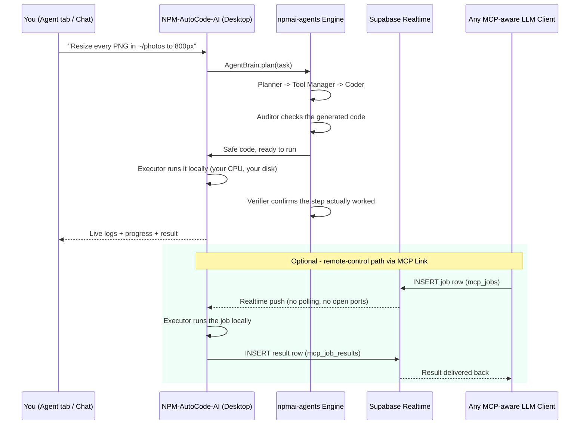

<div align="center">


<br/>

[](https://npmcodeai.netlify.app)
[](https://pypi.org/project/PySide6/)
[](https://pypi.org/project/npmai-agents/)
[](LICENSE)
[](https://deepwiki.com/npmaiecosystem/NPM-AutoCode-AI)

### ⬇️ [**[DOWNLOAD FOR YOUR OS → npmcodeai.netlify.app](https://npmcodeai.netlify.app/)**](https://npmcodeai.netlify.app) ⬇️
*Windows `.exe` · macOS `.app` · Linux binary — all built straight from this repo, every release.*

</div>

---

## 📜 Table of Contents
- [[What is this, really?](https://claude.ai/chat/95ed3814-731c-4c7c-9b4b-8ec42b76fc82#-what-is-this-really)](#-what-is-this-really)
- [[The Idea: MCP Without the Toll Booth](https://claude.ai/chat/95ed3814-731c-4c7c-9b4b-8ec42b76fc82#-the-idea-mcp-without-the-toll-booth)](#-the-idea-mcp-without-the-toll-booth)
- [[Architecture](https://claude.ai/chat/95ed3814-731c-4c7c-9b4b-8ec42b76fc82#-architecture)](#-architecture)
- [[The 6-Role Agent Pipeline](https://claude.ai/chat/95ed3814-731c-4c7c-9b4b-8ec42b76fc82#-the-6-role-agent-pipeline)](#-the-6-role-agent-pipeline)
- [[1,371 Tools, 10 Domains](https://claude.ai/chat/95ed3814-731c-4c7c-9b4b-8ec42b76fc82#-1371-tools-10-domains)](#-1371-tools-10-domains)
- [[Features](https://claude.ai/chat/95ed3814-731c-4c7c-9b4b-8ec42b76fc82#-features)](#-features)
- [[Download & Install](https://claude.ai/chat/95ed3814-731c-4c7c-9b4b-8ec42b76fc82#-download--install)](#-download--install)
- [[Configure LLMs (Optional Upgrade Path)](https://claude.ai/chat/95ed3814-731c-4c7c-9b4b-8ec42b76fc82#-configure-llms-optional-upgrade-path)](#-configure-llms-optional-upgrade-path)
- [[Credential Vault](https://claude.ai/chat/95ed3814-731c-4c7c-9b4b-8ec42b76fc82#-credential-vault)](#-credential-vault)
- [[Tech Stack](https://claude.ai/chat/95ed3814-731c-4c7c-9b4b-8ec42b76fc82#-tech-stack)](#-tech-stack)
- [[Roadmap](https://claude.ai/chat/95ed3814-731c-4c7c-9b4b-8ec42b76fc82#-roadmap)](#-roadmap)
- [[Contributing](https://claude.ai/chat/95ed3814-731c-4c7c-9b4b-8ec42b76fc82#-contributing)](#-contributing)
- [[License](https://claude.ai/chat/95ed3814-731c-4c7c-9b4b-8ec42b76fc82#-license)](#-license)

---

## 🧠 What is this, really?

**NPM-AutoCode-AI** is a desktop app: you type a task in plain English —
*"scrape this page and email me a summary"*, *"resize every image in this folder"*, *"push this fix to GitHub"* —
and it plans, writes, safety-audits, and runs the Python for you. Live, in front of you, on your own machine.

Under the hood, it's powered by **[`[npmai-agents](https://pypi.org/project/npmai-agents/)`](https://pypi.org/project/npmai-agents/)** — the actual open-source
reasoning engine (published on PyPI) that gives the app its **1,371 tools**, its safety auditing, and its
multi-role planning pipeline. NPM-AutoCode-AI is the face; `npmai-agents` is the brain.

---

## 💡 The Idea: MCP Without the Toll Booth

<div align="center">

</div>

Most **MCP (Model Context Protocol)** setups work like this: your LLM calls a *remote* server, that server calls
a *paid* API for every tool action, and you get billed per call, per token, per automation. That's fine for a SaaS —
but it's a toll booth on every single thing your AI does for you.

**NPM-AutoCode-AI inverts the model:**

- The **MCP link** (`mcp_link.py`) is just a thin, authless *job relay* over **Supabase Realtime** — no tunnels, no
  open ports, no third party sitting in the middle of your automation billing you per step.
- The **execution itself happens locally**, on your own desktop, using your own CPU/RAM — not a metered cloud sandbox.
- The **default reasoning models are free, local-first Ollama models** (`llama3.2`, `codellama:7b-instruct`,
  `qwen2.5-coder:7b`, `granite3.3:2b`) — the entire Planner → Tool Manager → Coder → Auditor → Verifier → Chatter
  pipeline runs **out of the box with zero API key**.
- Only if *you* want a stronger brain (GPT, Claude, Gemini...) do you ever touch an API key — and even then, it's
  **your** key, stored **locally, encrypted**, never proxied through us.

So instead of *"pay per automation,"* it's: **connect any MCP-aware LLM to your own machine, and let it drive tools
that already live on your computer, for the cost of electricity.**

---

## 🏗️ Architecture



**Why this matters:** the bottom half of that diagram is the part most products don't give you. Any MCP-compatible
LLM — running anywhere — can hand a job to *your* desktop app through Supabase's realtime channel, and the job
executes with your local Python, your local files, your local tools. No always-on server bill for you to run,
no per-call metering for the automation itself.

---

## 🧬 The 6-Role Agent Pipeline

`AgentBrain` (the core of `npmai-agents`) doesn't use one model for everything — it splits the job across
**six specialized roles**, each independently swappable from **Configure LLMs**:

| Stage | Job | Default (free, local) |
|---|---|---|
| 🧭 **Planner** | Breaks your task into atomic steps | `llama3.2:3b` |
| 🧰 **Tool Manager** | Picks which of the 1,371 tools apply | `llama3.2` |
| 👨‍💻 **Coder** | Writes the actual Python for each step | `codellama:7b-instruct` |
| 🛡 **Auditor** | Reviews the code for risk *before* it ever runs | `qwen2.5-coder:7b` |
| ✅ **Verifier** | Confirms a step genuinely completed | `llama3.2:3b` |
| 💬 **Chatter** | Handles plain conversation, non-task replies | `granite3.3:2b` |

Every one of these runs against **free, local Ollama models by default**. Want GPT-4o doing the planning and
Claude doing the coding instead? One click each in **Configure LLMs** — nothing else changes.

---

## 🧰 1,371 Tools, 10 Domains

`npmai-agents` ships **1,371 tools across 121 classes**, organized into 10 domain files so the Tool Manager can
route intelligently instead of guessing:

<div align="center">

| Domain | Domain | Domain |
|---|---|---|
| 🖥 Developer & CLI | 💼 Business | ☁️ Cloud & DevOps |
| 📡 Communication (extended) | 🎨 Creative | 📊 Data & Research |
| 🎬 Media | 🗂 Productivity | 🔐 Security & AI | 🔧 System & Hardware |

</div>

That's why the credentials system exists at all: most of these tools work with **zero setup** (local file ops,
system tasks, data processing) — only the ones that talk to a *third-party service* (GitHub, Twilio, Stripe,
AWS...) ever need a key, and even those keys stay on your machine.

---

## ✨ Features

- 🗣 **Natural language → working Python** — describe the task, watch it get built.
- 🛡 **Safety-audited before execution** — the Auditor role flags risky code (file deletion, remote access) before
  anything runs.
- 🔁 **Auto-debug loop** — errors get fed back to the Coder role and retried, not just dumped on you.
- 📈 **Live logs + progress bar** — full visibility while the agent works, nothing happens silently.
- 🔑 **Bring-your-own-key, never forced** — every LLM provider and every tool credential is opt-in and locally
  encrypted (`CredStore`).
- 🌐 **Remote-trigger via MCP Link** — connect any MCP-aware LLM client to your desktop through Supabase Realtime.
- 🖥 **True cross-platform** — native builds for Windows, macOS, and Linux from the same codebase.

---

## 📦 Download & Install

<div align="center">

### 👉 **[[npmcodeai.netlify.app](https://npmcodeai.netlify.app/)](https://npmcodeai.netlify.app)** — pick your OS, download, run.

| 🪟 Windows | 🍎 macOS | 🐧 Linux |
|:---:|:---:|:---:|
| `.exe`, no install needed | `.app` bundle | portable binary |

*Every build on that page is produced straight from this repo's GitHub Actions pipeline — same source, three
native binaries, no cross-compiling shortcuts.*

</div>

**Building from source instead?**

```bash
git clone https://github.com/npmaiecosystem/NPM-AutoCode-AI.git
cd NPM-AutoCode-AI/Desktop_App
pip install -r requirements.txt
python app.py
```

---

## ⚙️ Configure LLMs (Optional Upgrade Path)

Everything works day-one with the free local defaults above. If you want to swap in a hosted model for any of
the 6 roles — OpenAI, Anthropic, Gemini, Groq, Mistral, Cohere, Azure OpenAI, AWS Bedrock, HuggingFace, or a
local llama.cpp server — click **⚙ Configure LLMs** on the Agent tab:

1. **① Provider Credentials** — add only the fields that provider actually needs (most: just an API key).
2. **② Assign Provider + Model per Stage** — pick which provider handles Planner / Tool Manager / Coder /
   Auditor / Verifier / Chatter, individually.

Nothing here is required. It's a ceiling to raise if you want it, not a floor you have to clear to get started.

---

## 🔐 Credential Vault

Any tool that needs a third-party credential (GitHub, Twilio, Stripe, AWS, Notion, and 25+ more) stores it through
a **locally encrypted `CredStore`** — never synced to us, never proxied through a middleman. Settings even has a
generic **"+ Add Credential Group"** button so you can wire up a tool that isn't hardcoded yet: name the group,
add whatever key/value pairs that tool's docs ask for, done.

---

## 🛠 Tech Stack

<div align="center">


</div>

- **GUI:** PySide6 (custom animated widgets — glow cards, pulse buttons, cosmic background)
- **Engine:** `npmai-agents` (PyPI) — `AgentBrain`, `Executor`, `CredStore`, `Workspace`
- **Default inference:** `npmai` (Ollama-backed), fully local/free
- **Remote link:** `mcp_link.py` + Supabase Realtime (Postgres changes -> live push, no polling)
- **Packaging:** PyInstaller, one native build per OS via a matrix GitHub Actions workflow, auto-published to
  GitHub Releases and mirrored on [[npmcodeai.netlify.app](https://npmcodeai.netlify.app/)](https://npmcodeai.netlify.app)

---

## 🗺 Roadmap

- [ ] Expand the MCP Link job protocol beyond single-shot code execution (multi-step remote sessions)
- [ ] More hardcoded credential templates in Settings (currently GitHub/SMTP/Notion/Stripe/AWS + generic groups)
- [ ] In-app model download manager for the local Ollama defaults
- [ ] Signed installers for Windows/macOS (currently unsigned binaries)

---

## 🤝 Contributing

Issues and PRs welcome — especially new tools for `npmai-agents`, new hardcoded credential templates, or
platform-specific packaging fixes. Fork it, build it, send a PR.

## 📄 License

MIT — see [[LICENSE](https://claude.ai/chat/LICENSE)](LICENSE).

<div align="center">


**Built by the NPMAI ECOSYSTEM** — automation that runs on *your* machine, not someone else's meter.

</div>
